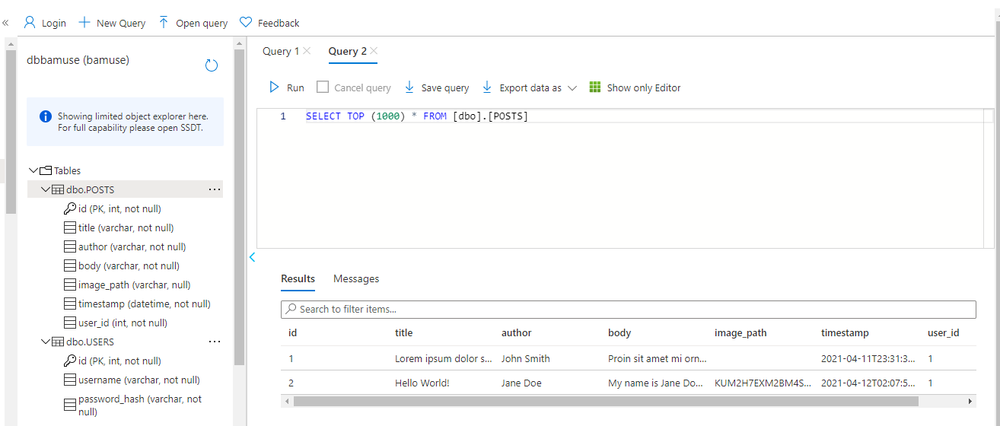

# Article CMS (FlaskWebProject)

This project is a Python web application built using Flask. The user can log in and out and create/edit articles. An article consists of a title, author, and body of text stored in an Azure SQL Server along with an image that is stored in Azure Blob Storage. You will also implement OAuth2 with Sign in with Microsoft using the `msal` library, along with app logging.

## images Folder
This folder contains sample screenshots that students are required to submit in order to prove they completed various tasks throughout the project.

1. article-cms-solution.png is a screenshot from running the FlaskWebProject on Azure and prove that the student was able to create a new entry. The Title, Author, and Body fields must be populated to prove that the data is being retrieved from the Azure SQL Database while the image on the right proves that an image was uploaded and pulled from Azure Blob Storage.

1. azure-portal-resource-group.png is a screenshot from the Azure Portal showing all of the contents of the Resource Group the student needs to create. The resource group must 

3. sql-storage-solution.png is a screenshot showing the created tables and one query of data from the initial scripts.

4. blob-solution.png is a screenshot showing an example of blob endpoints for where images are sent for storage.
  
5. uri-redirects-solution.png is a screenshot of the redirect URIs related to Microsoft authentication.

6. log-solution.png is a screenshot showing one potential form of logging with an "Invalid login attempt" and "admin logged in successfully", taken from the app's Log stream. You can customize your log messages as you see fit for these situations.

